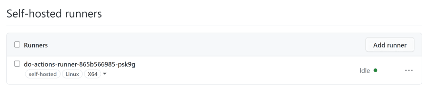
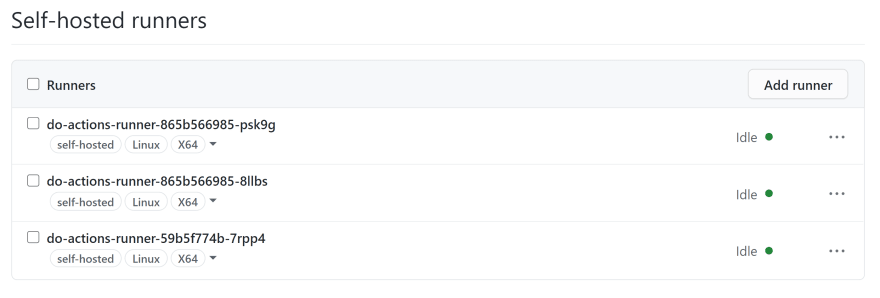
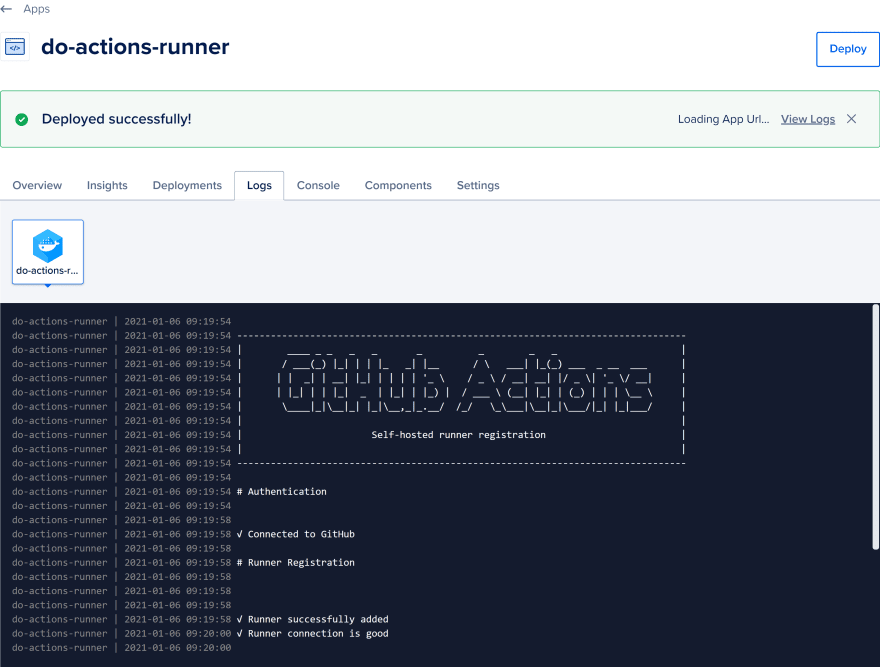

# Actions Runner on DigitalOcean App Platform

This is a [self hosted](https://docs.github.com/en/free-pro-team@latest/actions/hosting-your-own-runners/about-self-hosted-runners) GitHub Actions runner for deploying to [DigitalOcean App Platform](https://www.digitalocean.com/products/app-platform/). You will get the simplicity of automated cluster deployment and [scaling](https://www.digitalocean.com/docs/app-platform/concepts/scaling/) by DigitalOcean App Platform.

It will register and remove itself automatically when DigitalOcean App Platform start and stop [the container](https://www.digitalocean.com/docs/app-platform/concepts/container/). You can [vertical scale or horizontal scale](https://www.digitalocean.com/docs/app-platform/how-to/scale-app/) your runner. If you do a horizontal scale (Pro plan only), all runners will be automatically registered to GitHub.

This project is part of [DigitalOcean App Platform Hackathon](https://dev.to/devteam/announcing-the-digitalocean-app-platform-hackathon-on-dev-2i1k). See [submission](https://dev.to/thewdhanat/actions-runner-on-digitalocean-app-platform-30l4) post.

## Usage

Currently, we **cannot** deploy a new app that only has the worker. So you need to create a new app with a service then delete that service and create a worker.

This actions runners can be installed as a runner for [repository](https://docs.github.com/en/free-pro-team@latest/actions/hosting-your-own-runners/adding-self-hosted-runners#adding-a-self-hosted-runner-to-a-repository) and [organization](https://docs.github.com/en/free-pro-team@latest/actions/hosting-your-own-runners/adding-self-hosted-runners#adding-a-self-hosted-runner-to-an-organization).

### Environment variable

You must provide the following environment variables.

- `TOKEN` – Your GitHub [personal access token](https://docs.github.com/en/free-pro-team@latest/github/authenticating-to-github/creating-a-personal-access-token) with `repo` scope for repository-level and `admin:org` scope for organization-level runner. This token will be used for self-hosted runner registration.

#### Repository-level runner

- `OWNER` – Owner of the repository
- `REPO` – Repository name

#### Organization-level runner

- `ORG` – Organization name

## Screenshots

GitHub settings

Horizontal scaling

 

DigitalOcean dashboard

 

## Additional resources

